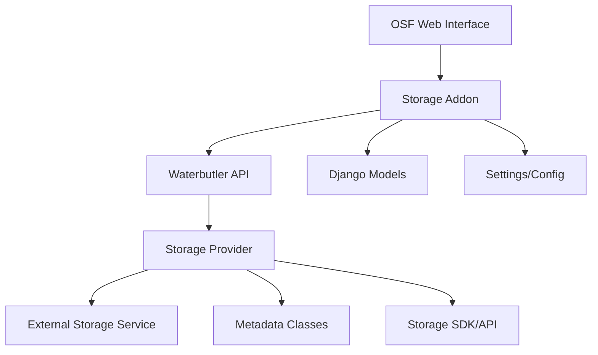

# OSF-GakuNin RDM Storage Addon Architecture

## Overview

This document outlines the architectural approach for extracting storage addons from the monolithic RDM-osf.io and RDM-waterbutler projects into independent packages. This enables modular development, maintenance, and deployment of storage integrations.

## Current Monolithic Architecture

### RDM-osf.io Storage Addons
- **Location**: `addons/{storage_type}/`
- **Type**: Django-based OSF addons
- **Examples**: `s3compat/`, `s3compatb3/`, `swift/`
- **Functionality**: Web UI, authentication, settings management
- **Dependencies**: Tightly coupled to OSF framework

### RDM-waterbutler Storage Providers
- **Location**: `waterbutler/providers/{storage_type}/`
- **Type**: Async file operation providers
- **Examples**: `s3compat/`, `s3compatb3/`, `swift/`
- **Functionality**: File CRUD operations, storage API communication
- **Dependencies**: Tightly coupled to Waterbutler core

### RDM-gravyvalet

*To be considered*


## Target Modular Architecture

### Independent Storage Packages
Each storage type becomes an independent Python package with a consistent structure:

```
{storage-name}/                    # e.g., s3compat, nextcloud, swift
├── setup.py
├── requirements.txt
├── README.md
├── {storage_name}/               # Top-level module (e.g., s3compat/)
│   ├── __init__.py
│   ├── osf_addon/               # OSF (GakuNin RDM) Integration Components
│   │   ├── __init__.py
│   │   ├── apps.py
│   │   ├── models.py
│   │   ├── views.py
│   │   ├── routes.py
│   │   ├── serializer.py
│   │   ├── utils.py
│   │   ├── provider.py
│   │   ├── settings/
│   │   └── static/
│   ├── waterbutler_provider/    # Waterbutler Integration Components
│   │   ├── __init__.py
│   │   ├── provider.py
│   │   ├── metadata.py
│   │   └── settings.py
│   └── tests/
└── docs/
```

### Package Naming Convention
- **Repository**: `RDM-storage-{name}` (e.g., `RDM-storage-s3compat`)
- **Python Package**: `{name}` (e.g., `s3compat`)
- **Import Path**: `{name}.osf_addon` or `{name}.waterbutler_provider`

## Architectural Principles

### 1. Separation of Concerns
Each storage addon package contains both OSF and Waterbutler components, maintaining their logical coupling while being physically separated from the main applications.

### 2. Contract-Based Integration
Standardized interfaces ensure compatibility between storage packages and the main RDM applications:

```python
# OSF Addon Contract
class BaseStorageNodeSettings:
    def serialize_waterbutler_credentials(self) -> dict
    def serialize_waterbutler_settings(self) -> dict
    def create_waterbutler_log(self, action, metadata) -> None

# Waterbutler Provider Contract  
class BaseStorageProvider:
    def __init__(self, auth, credentials, settings)
    async def download(self, path) -> StreamResponse
    async def upload(self, stream, path) -> Metadata
    async def metadata(self, path) -> List[Metadata]
```

### 3. Plugin Architecture
Storage packages are loaded as plugins at runtime, allowing for:
- Dynamic discovery of available storage types
- Conditional loading based on requirements
- Independent versioning and updates

## Component Communication

### Data Flow Architecture


### Inter-Component Contracts

#### Authentication Contract
```python
# OSF → Waterbutler credential format
credentials = {
    'host': str,           # Storage service endpoint
    'access_key': str,     # Access credentials
    'secret_key': str,     # Secret credentials
    # ... storage-specific fields
}
```

#### Settings Contract
```python
# OSF → Waterbutler settings format
settings = {
    'bucket': str,         # Container/bucket name
    'prefix': str,         # Path prefix (optional)
    'encrypt': bool,       # Encryption preference
    # ... storage-specific settings
}
```

## Plugin Loading System

### OSF Plugin Integration
OSF uses standard Django application configuration. Storage addons are simply added to `INSTALLED_APPS` during deployment configuration:

```python
# settings/local.py or production configuration
INSTALLED_APPS += [
    's3compat.osf_addon',  # Add storage addon
    # other external addons...
]

# Update addons.json to include the new storage type
ADDONS_AVAILABLE = ADDONS_AVAILABLE_DICT.keys()
```

No special discovery mechanism is required - standard Django app loading handles everything.

### Waterbutler Provider Discovery
Waterbutler uses its existing provider discovery mechanism through standard `waterbutler.providers` entry points. No additional loader code is required in Waterbutler - providers are automatically discovered when packages are installed with the correct entry points.

```python
# setup.py for each storage package
setup(
    name='{storage_name}',
    packages=['{storage_name}'],
    entry_points={
        'waterbutler.providers': [
            '{storage_name} = {storage_name}.waterbutler_provider:Provider',
        ],
        'rdm.admin_integrations': [
            '{storage_name} = {storage_name}.osf_addon.admin_integration:get_admin_integration_info',
        ],
    }
)
```

### Admin Integration Plugin System
GakuNin RDM admin modules can integrate with storage addons through a plugin system that allows dynamic discovery and loading of admin-specific functionality.

```python
# Storage package provides admin integration
# s3compat/osf_addon/admin_integration.py
def test_s3compat_connection(endpoint_url, access_key, secret_key, bucket_name=None):
    """Test connection with standardized interface"""
    return {
        'success': bool,
        'message': str,
        'user_info': dict,
        'can_list': bool,
        'bucket_exists': bool
    }

def get_admin_integration_info():
    """Plugin discovery information"""
    return {
        'provider_name': 's3compat',
        'display_name': 'S3 Compatible Storage',
        'test_connection_func': test_s3compat_connection,
        'supported_operations': ['test_connection', 'validate_credentials'],
        'required_credentials': ['endpoint_url', 'access_key', 'secret_key']
    }
```

```python
# Admin side discovers and uses plugins
# admin/rdm_custom_storage_location/plugin_loader.py
from importlib.metadata import entry_points

def discover_integrations():
    """Auto-discover admin integration plugins"""
    for entry_point in entry_points().select(group='rdm.admin_integrations'):
        integration_func = entry_point.load()
        integration_info = integration_func()
        # Register plugin capabilities

def get_test_connection_function(provider_name):
    """Get connection test function for storage provider"""
    integration_info = load_integration(provider_name)
    return integration_info.get('test_connection_func')
```

## Development Workflow

### Package Development
1. **Independent Development**: Each storage package developed in its own repository
2. **Standardized Testing**: Common test patterns and CI/CD configurations
3. **Documentation Standards**: Consistent API documentation and usage examples

### Integration Testing
```python
# Cross-package integration tests
class StorageIntegrationTest:
    def test_osf_waterbutler_flow(self):
        """Test complete OSF → Waterbutler → Storage flow"""
        # 1. Configure OSF addon
        # 2. Make Waterbutler API call
        # 3. Verify storage operation
        # 4. Validate response format
```

### Release Management
- **Independent Versioning**: Each storage package maintains its own version
- **Compatibility Matrix**: Clear documentation of version compatibility
- **Staged Rollout**: Ability to update storage packages independently


## Admin Plugin Standards

### Plugin Interface Contract
All storage packages should implement a standardized admin integration interface:

```python
def get_admin_integration_info():
    """Required function for admin plugin discovery"""
    return {
        'provider_name': str,           # Unique provider identifier
        'display_name': str,            # Human-readable name
        'test_connection_func': callable, # Connection test function
        'supported_operations': list,   # Available admin operations
        'required_credentials': list,   # Required credential fields
        'optional_parameters': list     # Optional parameter fields
    }
```

### Connection Test Function Contract
```python
def test_connection(endpoint_url, access_key, secret_key, bucket_name=None):
    """Standardized connection test interface"""
    return {
        'success': bool,              # Overall test result
        'message': str,              # Human-readable status message
        'user_info': dict or None,   # User account information
        'can_list': bool,            # Bucket listing capability
        'bucket_exists': bool or None # Specific bucket existence
    }
```

### Plugin Discovery Flow
1. **Registration**: Storage packages register via `rdm.admin_integrations` entry point
2. **Discovery**: Admin modules scan entry points at runtime
3. **Loading**: Functions loaded dynamically when needed
4. **Execution**: Standardized interface ensures consistent behavior
5. **Fallback**: Graceful degradation when plugins unavailable


## Template Plugin System

The template plugin system allows storage addons to provide their own Django templates that are dynamically loaded by the admin interface. This separates template code from the main admin codebase.

### Template Structure

Templates are stored in the addon package under:
```
s3compat/osf_addon/templates/rdm_custom_storage_location/providers/
├── s3compat_modal.html
└── ... (other templates)
```

### Admin Integration

The admin integration function returns template information:

```python
def get_admin_integration_info():
    return {
        'provider_name': 's3compat',
        'display_name': 'S3 Compatible Storage',
        'templates': {
            'modal': {
                'name': 's3compat_modal.html',
                'path': 'rdm_custom_storage_location/providers/s3compat_modal.html',
            }
        },
        'template_functions': {
            'get_template_path': get_template_path,
            'get_template_content': get_template_content
        }
    }
```

### Template Loading

The admin interface uses custom template tags to load plugin templates:

```django




```

### Template Plugin Loader

A custom Django template loader (`PluginTemplateLoader`) discovers and loads templates from plugins:

```python
# admin/rdm_custom_storage_location/template_loader.py
class PluginTemplateLoader(BaseLoader):
    def get_contents(self, origin):
        content = get_plugin_template_content(origin.provider_name, template_file)
        return content
```

### Fallback Support

The system gracefully falls back to built-in templates if plugin templates are unavailable:

1. Try plugin template first
2. Fall back to admin/templates/rdm_custom_storage_location/providers/
3. Show error message if neither available

### Template Plugin Implementation Components

#### 1. Admin Integration Module
- **File**: `s3compat/osf_addon/admin_integration.py`
- **Functions**: `get_template_path()`, `get_template_content()`, `get_admin_integration_info()`
- **Purpose**: Provides template access functions and integration metadata

#### 2. Plugin Discovery System
- **File**: `admin/rdm_custom_storage_location/plugin_loader.py`
- **Class**: `StorageAdminPluginLoader`
- **Purpose**: Discovers and loads admin integration plugins using entry points

#### 3. Custom Template Loader
- **File**: `admin/rdm_custom_storage_location/template_loader.py`
- **Class**: `PluginTemplateLoader`
- **Purpose**: Django template loader that can load templates from plugins

#### 4. Template Utilities
- **File**: `admin/rdm_custom_storage_location/template_utils.py`
- **Functions**: `render_storage_template()`, `get_storage_modal_template()`
- **Purpose**: High-level template rendering utilities

#### 5. Custom Template Tags
- **File**: `admin/rdm_custom_storage_location/templatetags/storage_tags.py`
- **Tags**: ``, ``
- **Purpose**: Django template tags for easy plugin template inclusion
