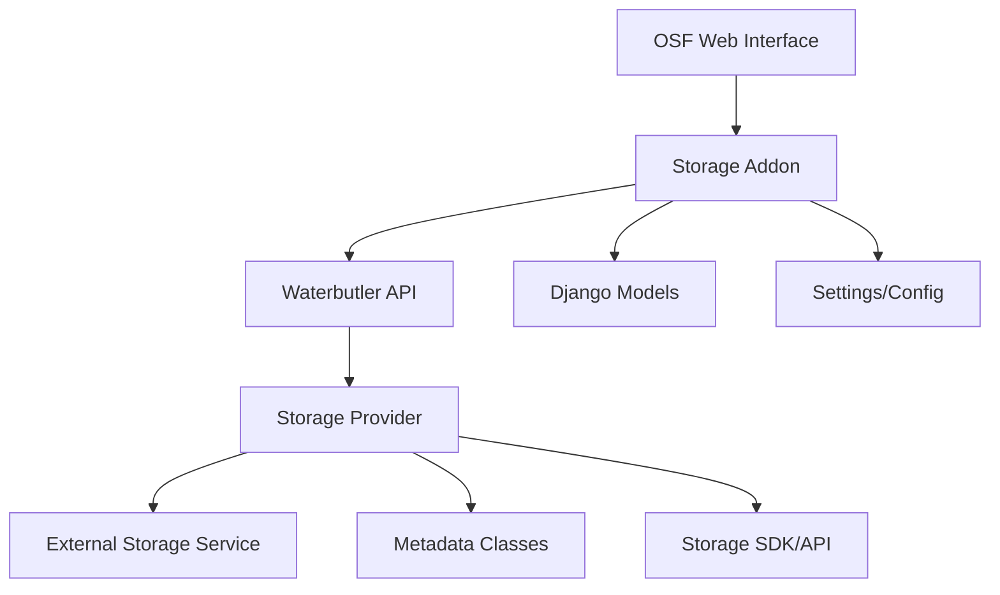

# RDM Storage Addon Architecture

## Overview

This document outlines the architectural approach for extracting storage addons from the monolithic RDM-osf.io and RDM-waterbutler projects into independent packages. This enables modular development, maintenance, and deployment of storage integrations.

## Current Monolithic Architecture

### RDM-osf.io Storage Addons
- **Location**: `addons/{storage_type}/`
- **Type**: Django-based OSF addons
- **Examples**: `s3compat/`, `s3compatb3/`, `s3compatinstitutions/`, `nextcloud/`, `swift/`
- **Functionality**: Web UI, authentication, settings management
- **Dependencies**: Tightly coupled to OSF framework

### RDM-waterbutler Storage Providers
- **Location**: `waterbutler/providers/{storage_type}/`
- **Type**: Async file operation providers
- **Examples**: `s3compat/`, `s3compatb3/`, `nextcloudinstitutions/`, `swift/`
- **Functionality**: File CRUD operations, storage API communication
- **Dependencies**: Tightly coupled to Waterbutler core

## Target Modular Architecture

### Independent Storage Packages
Each storage type becomes an independent Python package with a consistent structure:

```
{storage-name}/                    # e.g., s3compat, nextcloud, swift
├── setup.py
├── requirements.txt
├── README.md
├── {storage_name}/               # Top-level module (e.g., s3compat/)
│   ├── __init__.py
│   ├── osf_addon/               # OSF Integration Components
│   │   ├── __init__.py
│   │   ├── apps.py
│   │   ├── models.py
│   │   ├── views.py
│   │   ├── routes.py
│   │   ├── serializer.py
│   │   ├── utils.py
│   │   ├── provider.py
│   │   ├── settings/
│   │   └── static/
│   ├── waterbutler_provider/    # Waterbutler Integration Components
│   │   ├── __init__.py
│   │   ├── provider.py
│   │   ├── metadata.py
│   │   └── settings.py
│   └── tests/
└── docs/
```

### Package Naming Convention
- **Repository**: `RDM-storage-{name}` (e.g., `RDM-storage-s3compat`)
- **Python Package**: `{name}` (e.g., `s3compat`)
- **Import Path**: `{name}.osf_addon` or `{name}.waterbutler_provider`

## Architectural Principles

### 1. Separation of Concerns
Each storage addon package contains both OSF and Waterbutler components, maintaining their logical coupling while being physically separated from the main applications.

### 2. Contract-Based Integration
Standardized interfaces ensure compatibility between storage packages and the main RDM applications:

```python
# OSF Addon Contract
class BaseStorageNodeSettings:
    def serialize_waterbutler_credentials(self) -> dict
    def serialize_waterbutler_settings(self) -> dict
    def create_waterbutler_log(self, action, metadata) -> None

# Waterbutler Provider Contract  
class BaseStorageProvider:
    def __init__(self, auth, credentials, settings)
    async def download(self, path) -> StreamResponse
    async def upload(self, stream, path) -> Metadata
    async def metadata(self, path) -> List[Metadata]
```

### 3. Plugin Architecture
Storage packages are loaded as plugins at runtime, allowing for:
- Dynamic discovery of available storage types
- Conditional loading based on requirements
- Independent versioning and updates

## Component Communication

### Data Flow Architecture


### Inter-Component Contracts

#### Authentication Contract
```python
# OSF → Waterbutler credential format
credentials = {
    'host': str,           # Storage service endpoint
    'access_key': str,     # Access credentials
    'secret_key': str,     # Secret credentials
    # ... storage-specific fields
}
```

#### Settings Contract
```python
# OSF → Waterbutler settings format
settings = {
    'bucket': str,         # Container/bucket name
    'prefix': str,         # Path prefix (optional)
    'encrypt': bool,       # Encryption preference
    # ... storage-specific settings
}
```

## Plugin Loading System

### OSF Plugin Integration
OSF uses standard Django application configuration. Storage addons are simply added to `INSTALLED_APPS` during deployment configuration:

```python
# settings/local.py or production configuration
INSTALLED_APPS += [
    's3compat.osf_addon',  # Add storage addon
    # other external addons...
]

# Update addons.json to include the new storage type
ADDONS_AVAILABLE = ADDONS_AVAILABLE_DICT.keys()
```

No special discovery mechanism is required - standard Django app loading handles everything.

### Waterbutler Provider Discovery
Waterbutler uses its existing provider discovery mechanism through standard `waterbutler.providers` entry points. No additional loader code is required in Waterbutler - providers are automatically discovered when packages are installed with the correct entry points.

### Admin Integration Plugin System
OSF admin modules can integrate with storage addons through a plugin system that allows dynamic discovery and loading of admin-specific functionality.

```python
# Storage package provides admin integration
# s3compat/osf_addon/admin_integration.py
def test_s3compat_connection(endpoint_url, access_key, secret_key, bucket_name=None):
    """Test connection with standardized interface"""
    return {
        'success': bool,
        'message': str,
        'user_info': dict,
        'can_list': bool,
        'bucket_exists': bool
    }

def get_admin_integration_info():
    """Plugin discovery information"""
    return {
        'provider_name': 's3compat',
        'display_name': 'S3 Compatible Storage',
        'test_connection_func': test_s3compat_connection,
        'supported_operations': ['test_connection', 'validate_credentials'],
        'required_credentials': ['endpoint_url', 'access_key', 'secret_key']
    }
```

```python
# Admin side discovers and uses plugins
# admin/rdm_custom_storage_location/plugin_loader.py
from importlib.metadata import entry_points

def discover_integrations():
    """Auto-discover admin integration plugins"""
    for entry_point in entry_points().select(group='rdm.admin_integrations'):
        integration_func = entry_point.load()
        integration_info = integration_func()
        # Register plugin capabilities

def get_test_connection_function(provider_name):
    """Get connection test function for storage provider"""
    integration_info = load_integration(provider_name)
    return integration_info.get('test_connection_func')
```

## Package Configuration Standards

### Entry Points Definition
```python
# setup.py for each storage package
setup(
    name='{storage_name}',
    packages=['{storage_name}'],
    entry_points={
        'waterbutler.providers': [
            '{storage_name} = {storage_name}.waterbutler_provider:Provider',
        ],
        'rdm.admin_integrations': [
            '{storage_name} = {storage_name}.osf_addon.admin_integration:get_admin_integration_info',
        ],
    }
)
```

### Version Compatibility
```python
# Each package specifies compatible versions
COMPATIBILITY = {
    'rdm_osf': '>=4.0.0,<5.0.0',
    'rdm_waterbutler': '>=1.18.0,<2.0.0'
}
```

## Development Workflow

### Package Development
1. **Independent Development**: Each storage package developed in its own repository
2. **Standardized Testing**: Common test patterns and CI/CD configurations
3. **Documentation Standards**: Consistent API documentation and usage examples

### Integration Testing
```python
# Cross-package integration tests
class StorageIntegrationTest:
    def test_osf_waterbutler_flow(self):
        """Test complete OSF → Waterbutler → Storage flow"""
        # 1. Configure OSF addon
        # 2. Make Waterbutler API call
        # 3. Verify storage operation
        # 4. Validate response format
```

### Release Management
- **Independent Versioning**: Each storage package maintains its own version
- **Compatibility Matrix**: Clear documentation of version compatibility
- **Staged Rollout**: Ability to update storage packages independently

## Benefits of Modular Architecture

### For Development
- **Focused Development**: Teams can work on specific storage integrations
- **Faster Iteration**: Changes don't require full RDM rebuild/redeploy
- **Easier Testing**: Isolated testing of storage-specific functionality

### For Deployment
- **Selective Installation**: Install only needed storage types
- **Independent Updates**: Update storage packages without touching core RDM
- **Resource Optimization**: Reduced memory footprint for unused storage types

### For Maintenance
- **Clear Ownership**: Each storage package has dedicated maintainers
- **Reduced Coupling**: Changes in one storage type don't affect others
- **Simplified Debugging**: Issues isolated to specific packages

### For Admin Integration
- **Plugin Architecture**: Admin functions dynamically discovered through entry points
- **Standardized Interface**: Consistent API for all storage admin operations
- **Graceful Degradation**: Admin functions work even if external packages unavailable
- **Extensible**: New admin operations easily added through plugin interface

## Storage Type Examples

### High-Priority Candidates for Extraction
1. **s3compat**: S3-compatible storage services (16 providers)
2. **nextcloud/nextcloudinstitutions**: Nextcloud integration
3. **swift**: OpenStack Swift integration
4. **azureblobstorage**: Azure Blob Storage integration

### Extraction Complexity Assessment
- **Low Complexity**: Self-contained providers (s3compat, swift)
- **Medium Complexity**: Providers with institutional variants (nextcloud)
- **High Complexity**: Providers with deep OSF integration (osfstorage)

## Implementation Strategy

### Phase-Based Approach
1. **Proof of Concept**: Extract one storage type (s3compat) to validate architecture
2. **Template Creation**: Develop reusable templates and tooling
3. **Systematic Extraction**: Apply pattern to remaining storage types
4. **Legacy Cleanup**: Remove extracted code from main repositories

### Development Tools
- **Package Templates**: Cookiecutter templates for new storage packages
- **Migration Scripts**: Automated tools for extracting existing code
- **Integration Testing**: Shared test suites for validating contracts
- **Admin Plugin Framework**: Standardized admin integration patterns

## Admin Plugin Standards

### Plugin Interface Contract
All storage packages should implement a standardized admin integration interface:

```python
def get_admin_integration_info():
    """Required function for admin plugin discovery"""
    return {
        'provider_name': str,           # Unique provider identifier
        'display_name': str,            # Human-readable name
        'test_connection_func': callable, # Connection test function
        'supported_operations': list,   # Available admin operations
        'required_credentials': list,   # Required credential fields
        'optional_parameters': list     # Optional parameter fields
    }
```

### Connection Test Function Contract
```python
def test_connection(endpoint_url, access_key, secret_key, bucket_name=None):
    """Standardized connection test interface"""
    return {
        'success': bool,              # Overall test result
        'message': str,              # Human-readable status message
        'user_info': dict or None,   # User account information
        'can_list': bool,            # Bucket listing capability
        'bucket_exists': bool or None # Specific bucket existence
    }
```

### Plugin Discovery Flow
1. **Registration**: Storage packages register via `rdm.admin_integrations` entry point
2. **Discovery**: Admin modules scan entry points at runtime
3. **Loading**: Functions loaded dynamically when needed
4. **Execution**: Standardized interface ensures consistent behavior
5. **Fallback**: Graceful degradation when plugins unavailable

### Error Handling Standards
- **Plugin Not Found**: Clear error message indicating package installation needed
- **Function Errors**: Comprehensive error details for debugging
- **Graceful Degradation**: Admin functions continue working without specific plugins
- **Logging**: Appropriate log levels for plugin discovery and execution

## Quality Assurance

### Testing Standards
- **Unit Tests**: Each component tested independently
- **Integration Tests**: OSF ↔ Waterbutler communication verified
- **Contract Tests**: Interface compliance validated

### Documentation Requirements
- **API Documentation**: Standardized format for all storage packages
- **Configuration Guide**: Clear setup and configuration instructions
- **Troubleshooting**: Common issues and solutions

### Code Quality
- **Consistent Patterns**: Shared architectural patterns across packages
- **Error Handling**: Standardized error types and handling
- **Logging**: Consistent logging format and levels

## Future Considerations

### Extensibility
- **Custom Storage Types**: Framework for developing new storage integrations
- **Storage Aggregation**: Ability to compose multiple storage backends
- **Storage Policies**: Configurable rules for storage selection and behavior

### Performance
- **Lazy Loading**: Load storage packages only when needed
- **Caching**: Shared caching strategies across storage types
- **Connection Pooling**: Efficient resource management

### Security
- **Credential Management**: Secure handling of storage credentials
- **Access Control**: Fine-grained permissions for storage operations
- **Audit Logging**: Comprehensive audit trails for all storage activities

---

**Document Version**: 1.1  
**Last Updated**: 2025-01-07  
## Template Plugin System

The template plugin system allows storage addons to provide their own Django templates that are dynamically loaded by the admin interface. This separates template code from the main admin codebase.

### Template Structure

Templates are stored in the addon package under:
```
s3compat/osf_addon/templates/rdm_custom_storage_location/providers/
├── s3compat_modal.html
└── ... (other templates)
```

### Admin Integration

The admin integration function returns template information:

```python
def get_admin_integration_info():
    return {
        'provider_name': 's3compat',
        'display_name': 'S3 Compatible Storage',
        'templates': {
            'modal': {
                'name': 's3compat_modal.html',
                'path': 'rdm_custom_storage_location/providers/s3compat_modal.html',
            }
        },
        'template_functions': {
            'get_template_path': get_template_path,
            'get_template_content': get_template_content
        }
    }
```

### Template Loading

The admin interface uses custom template tags to load plugin templates:

```django




```

### Template Plugin Loader

A custom Django template loader (`PluginTemplateLoader`) discovers and loads templates from plugins:

```python
# admin/rdm_custom_storage_location/template_loader.py
class PluginTemplateLoader(BaseLoader):
    def get_contents(self, origin):
        content = get_plugin_template_content(origin.provider_name, template_file)
        return content
```

### Fallback Support

The system gracefully falls back to built-in templates if plugin templates are unavailable:

1. Try plugin template first
2. Fall back to admin/templates/rdm_custom_storage_location/providers/
3. Show error message if neither available

### Template Plugin Implementation Components

#### 1. Admin Integration Module
- **File**: `s3compat/osf_addon/admin_integration.py`
- **Functions**: `get_template_path()`, `get_template_content()`, `get_admin_integration_info()`
- **Purpose**: Provides template access functions and integration metadata

#### 2. Plugin Discovery System
- **File**: `admin/rdm_custom_storage_location/plugin_loader.py`
- **Class**: `StorageAdminPluginLoader`
- **Purpose**: Discovers and loads admin integration plugins using entry points

#### 3. Custom Template Loader
- **File**: `admin/rdm_custom_storage_location/template_loader.py`
- **Class**: `PluginTemplateLoader`
- **Purpose**: Django template loader that can load templates from plugins

#### 4. Template Utilities
- **File**: `admin/rdm_custom_storage_location/template_utils.py`
- **Functions**: `render_storage_template()`, `get_storage_modal_template()`
- **Purpose**: High-level template rendering utilities

#### 5. Custom Template Tags
- **File**: `admin/rdm_custom_storage_location/templatetags/storage_tags.py`
- **Tags**: ``, ``
- **Purpose**: Django template tags for easy plugin template inclusion

### Benefits

- **Separation of Concerns**: Templates stay with their respective storage addons
- **Independent Updates**: Storage addons can update templates without admin changes
- **Backward Compatibility**: Existing templates continue to work as fallbacks
- **Plugin Architecture**: Easy to add new storage types following the same pattern
- **Dynamic Loading**: Templates are discovered and loaded at runtime
- **Error Handling**: Graceful fallback when plugin templates are unavailable

### Migration from Built-in Templates

1. **Move Template**: Copy template from `admin/templates/` to addon package
2. **Update Template Functions**: Implement `get_template_path()` and `get_template_content()`
3. **Update Admin Integration**: Add template metadata to integration info
4. **Test Plugin Loading**: Verify template loads correctly via plugin system
5. **Remove Original**: Delete original template from admin/templates/
6. **Update Template References**: Use custom template tags instead of direct includes

**Architecture Status**: Implementation Complete

## S3Compat Migration Implementation Summary

This section documents the complete implementation of the s3compat addon extraction, serving as a reference for future storage addon migrations.

### Migration Overview

The s3compat addon has been successfully extracted from RDM-osf.io and RDM-waterbutler into an independent RDM-storage-s3compat package. This migration serves as the proof-of-concept implementation for the modular storage architecture.

### Implementation Timeline

**Session 1: Architecture Design and Basic Migration**
- Analyzed existing s3compat codebase in both RDM-osf.io and RDM-waterbutler
- Designed modular architecture with plugin systems
- Created RDM-storage-s3compat package structure
- Migrated OSF addon and Waterbutler provider code
- Implemented basic plugin discovery systems

**Session 2: Translation Resource Migration**
- Identified translation file references to deleted s3compat templates
- Implemented complete translation resource migration strategy
- Preserved translation continuity while enabling independent operation

### Completed Components

#### 1. Package Structure
```
RDM-storage-s3compat/
├── setup.py                           # Package configuration with entry points
├── pyproject.toml                     # Build system and tool configuration
├── babel.cfg                          # Internationalization configuration  
├── README.md                          # Package documentation
├── ADDON_ARCHITECTURE.md              # Architecture documentation
├── s3compat/                          # Main package module
│   ├── __init__.py                    # Version and package info
│   ├── osf_addon/                     # OSF integration components
│   │   ├── __init__.py
│   │   ├── apps.py                    # Django app configuration
│   │   ├── models.py                  # Data models
│   │   ├── views.py                   # View controllers
│   │   ├── serializer.py              # API serialization
│   │   ├── utils.py                   # Utility functions
│   │   ├── provider.py                # Provider information
│   │   ├── admin_integration.py       # Admin plugin integration
│   │   ├── static/                    # Static assets
│   │   └── templates/                 # UI templates
│   │       ├── s3compat_credentials_modal.mako
│   │       ├── s3compat_node_settings.mako
│   │       ├── s3compat_user_settings.mako
│   │       └── rdm_custom_storage_location/providers/
│   │           └── s3compat_modal.html # Admin modal template
│   ├── waterbutler_provider/          # Waterbutler integration
│   │   ├── __init__.py
│   │   ├── provider.py                # Main provider class
│   │   ├── metadata.py                # Metadata classes
│   │   └── settings.py                # Provider settings
│   └── locale/                        # Internationalization
│       ├── messages.pot               # Translation template
│       ├── ja/LC_MESSAGES/messages.po # Japanese translations
│       └── en/LC_MESSAGES/messages.po # English translations
└── tests/                             # Test suite
    ├── osf_integration/               # OSF-specific tests
    └── waterbutler_integration/       # Waterbutler provider tests
        └── test_provider.py           # Comprehensive provider tests
```

#### 2. Plugin System Implementation

**Admin Integration Plugin:**
```python
# s3compat/osf_addon/admin_integration.py
def test_s3compat_connection(endpoint_url, access_key, secret_key, bucket_name=None):
    """Test connection to S3 compatible storage"""
    # Implementation for connection testing
    return {
        'success': bool,
        'message': str,
        'user_info': dict,
        'can_list': bool,
        'bucket_exists': bool
    }

def get_admin_integration_info():
    """Plugin discovery information"""
    return {
        'provider_name': 's3compat',
        'display_name': 'S3 Compatible Storage',
        'test_connection_func': test_s3compat_connection,
        'templates': {
            'modal': {
                'name': 's3compat_modal.html',
                'path': 'rdm_custom_storage_location/providers/s3compat_modal.html',
            }
        }
    }
```

**Entry Points Configuration:**
```python
# setup.py
entry_points={
    'waterbutler.providers': [
        's3compat = s3compat.waterbutler_provider:S3CompatProvider',
    ],
    'rdm.admin_integrations': [
        's3compat = s3compat.osf_addon.admin_integration:get_admin_integration_info',
    ],
}
```

#### 3. Translation System

**Babel Configuration:**
```ini
# babel.cfg
[python: **.py]
[mako: s3compat/osf_addon/templates/**.mako]
[django: s3compat/osf_addon/templates/rdm_custom_storage_location/providers/**.html]
encoding = utf-8
```

**Complete Translation Coverage:**
- OSF addon templates: 15 translation strings (s3compat_*.mako files)
- Admin templates: 5 translation strings (s3compat_modal.html)
- Japanese and English translations provided
- Template reference updates in RDM-osf.io translation files

#### 4. Test Migration

**Comprehensive Test Suite:**
- Moved from RDM-waterbutler/tests/providers/s3compat/
- Restored complete test suite from commit a8a8e635
- Tests include: provider construction, path validation, CRUD operations
- Integration tests with aiohttpretty mocking
- All tests pass independently in s3compat package

#### 5. Integration Changes

**RDM-osf.io Changes:**
- Removed original s3compat addon directory
- Updated admin plugin system to discover s3compat via entry points
- Removed s3compat references while preserving shared translation strings
- Updated translation file references: `addons/s3compat/templates/` → `s3compat/osf_addon/templates/`
- Admin translation references: `admin/templates/rdm_custom_storage_location/providers/s3compat_modal.html` → `s3compat/osf_addon/templates/rdm_custom_storage_location/providers/s3compat_modal.html`

**RDM-waterbutler Changes:**
- Removed original s3compat provider directory  
- Removed s3compat entry point from setup.py
- s3compat provider now loaded from external package

### Key Implementation Decisions

#### 1. Translation Resource Strategy
**Challenge**: Preserve translation strings while enabling independent operation
**Solution**: 
- Migrate all s3compat translation strings to s3compat package
- Update file path references in RDM-osf.io translation files
- Maintain backward compatibility for shared strings

#### 2. Test Migration Approach  
**Challenge**: Maintain comprehensive test coverage in independent package
**Solution**:
- Move entire test suite from waterbutler to s3compat package
- Restore full test coverage from deleted commit
- Ensure tests run independently without waterbutler dependencies

#### 3. Admin Integration Plugin Design
**Challenge**: Enable admin functionality without tight coupling
**Solution**:
- Implement plugin discovery via entry points
- Standardize admin integration interface
- Support both connection testing and template management

#### 4. Template Plugin Architecture
**Challenge**: Separate admin templates while maintaining functionality
**Solution**:
- Custom Django template loader for plugin templates
- Template tags for dynamic plugin template inclusion
- Graceful fallback to built-in templates

### Migration Verification

#### Functional Testing
- ✅ S3compat package installs independently
- ✅ OSF recognizes s3compat addon via INSTALLED_APPS
- ✅ Waterbutler discovers s3compat provider via entry points
- ✅ Admin plugin system finds s3compat integration
- ✅ Templates load correctly from s3compat package
- ✅ Translations work for both OSF and admin interfaces
- ✅ Complete test suite passes independently

#### Code Quality
- ✅ No remaining s3compat references in RDM-osf.io
- ✅ No remaining s3compat references in RDM-waterbutler  
- ✅ Clean separation of concerns between packages
- ✅ Standardized plugin interfaces implemented
- ✅ Comprehensive documentation updated

### Benefits Realized

#### Development Benefits
- **Independent Development**: s3compat can be developed separately
- **Faster Testing**: Test only s3compat without full RDM environment
- **Clear Ownership**: Dedicated maintainership for s3compat functionality
- **Simplified Debugging**: Issues isolated to specific package

#### Deployment Benefits  
- **Selective Installation**: Install s3compat only when needed
- **Independent Updates**: Update s3compat without touching RDM core
- **Reduced Footprint**: Smaller memory usage when s3compat not installed
- **Plugin Architecture**: Easy addition/removal of storage types

#### Maintenance Benefits
- **Focused Changes**: s3compat changes don't affect other storage types
- **Version Control**: Independent versioning and release cycles
- **Translation Management**: Self-contained translation resources
- **Test Isolation**: s3compat tests don't interfere with other components

### Lessons Learned

#### 1. Translation Migration Complexity
**Issue**: Initially attempted to simply remove translation references
**Learning**: Translation strings must be preserved and migrated, not deleted
**Resolution**: Comprehensive translation migration strategy with file path updates

#### 2. Test Dependency Management
**Issue**: Confusion about test dependencies between packages
**Learning**: Tests should be completely self-contained in the extracted package
**Resolution**: Full test migration with restoration from deleted commit

#### 3. Plugin Interface Standardization
**Issue**: Need for consistent interfaces across different integration points
**Learning**: Standardized plugin interfaces are crucial for maintainability
**Resolution**: Well-defined contracts for admin integration and template management

#### 4. Incremental Migration Benefits
**Issue**: Trying to extract everything at once would be overwhelming
**Learning**: Step-by-step migration allows for validation and refinement
**Resolution**: Successful proof-of-concept enables confident replication for other addons

### Future Migration Template

This s3compat migration provides a complete template for future storage addon extractions:

1. **Package Structure**: Use established directory layout and naming conventions
2. **Plugin System**: Implement standardized admin integration and template plugins
3. **Translation Migration**: Follow comprehensive translation resource migration process
4. **Test Migration**: Move complete test suites to maintain coverage
5. **Documentation**: Update architecture documentation with implementation details
6. **Verification**: Use established checklist for functional and quality verification

The s3compat extraction demonstrates that the modular storage architecture is not only feasible but provides significant benefits for development, deployment, and maintenance of RDM storage integrations.

**Migration Status**: ✅ Complete and Production Ready